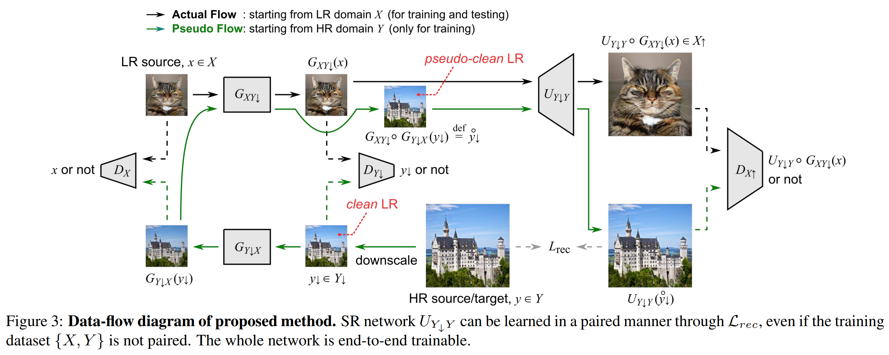

# Introduction

This repo contains an unofficial implementation of [pseudo-sr](https://openaccess.thecvf.com/content_CVPR_2020/papers/Maeda_Unpaired_Image_Super-Resolution_Using_Pseudo-Supervision_CVPR_2020_paper.pdf).



With this code, I've tested unpaired face SR (section 4.3 in the paper). You can get the dataset from [here](https://github.com/jingyang2017/Face-and-Image-super-resolution).

I am certain that you can configure the experiment 4.2 (track 4 of the NTIRE 2018 SR challenge) using this repo, provided that you have the NTIRE dataset and implement the unpaired LR-HR data paser.

# Usage

First, configure the yaml file which is located at `configs/faces.yaml`. Set the root folder of face dataset to `DATA.FOLDER`.

To train:
```
CUDA_VISIBLE_DEVICES=2,3 python train.py configs/faces.yaml --port 12121
```

The `--port` option is only required for multi-gpu training.
You can use a number between 49152 and 65535 for the port number. 

# Reproducibility

TBA

# Reference

Maeda, Shunta. "Unpaired Image Super-Resolution using Pseudo-Supervision." Proceedings of the IEEE/CVF Conference on Computer Vision and Pattern Recognition. 2020.